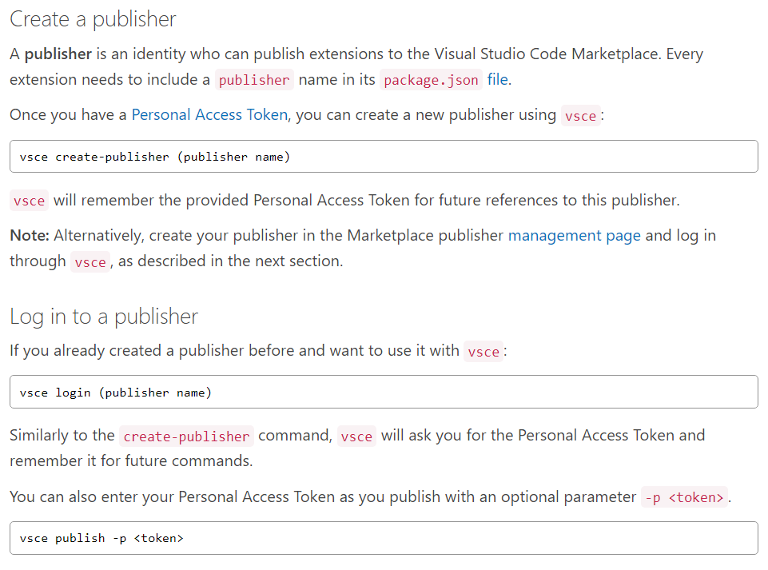

# Guide

### Create an Extension Guide
https://itnext.io/creating-and-publishing-vs-code-extensions-912b5b8b529

### Creating Snippets
https://levelup.gitconnected.com/snippets-for-vs-code-6b36fc4ef11f

### View all my extensions
https://marketplace.visualstudio.com/manage/publishers/kdashivantha
create an account there..

### Publishing Extensions

### Get a Personal Access Token

https://code.visualstudio.com/api/working-with-extensions/publishing-extension

### version upgrade and republish

